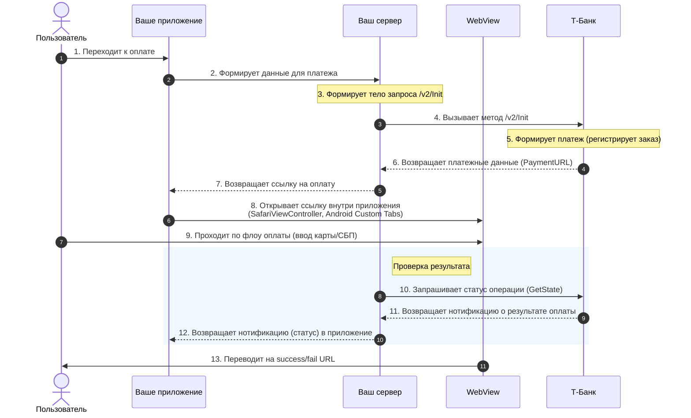

# Инициировать платеж (/v2/Init)

Метод инициирует платеж (регистрирует заказ) и возвращает ссылку на платежную форму.

- **HTTP-метод:** `POST`
- **URL (Test):** `https://rest-api-test.tinkoff.ru/v2/Init`
- **Content-Type:** `application/json`

---

## Параметры запроса (Top-level)

Параметры передаются в теле запроса (JSON).

| Параметр | Тип | Обяз. | Описание и требования |
| :--- | :--- | :--- | :--- |
| **TerminalKey** | `String` | **Да** | Идентификатор терминала. Выдается в ЛК Т-Бизнес. Макс. 20 символов. |
| **Amount** | `Number` | **Да** | Сумма заказа в копейках (напр. `1000` = 10.00 руб). Должна совпадать с суммой всех `Items.Amount`. |
| **OrderId** | `String` | **Да** | Уникальный номер заказа в системе магазина. Макс. 36 символов. |
| **Token** | `String` | **Да** | Подпись запроса (SHA-256). |
| **Description** | `String` | Нет | Описание заказа. Отображается на платежной форме. Макс. 140 символов. |
| **CustomerKey** | `String` | Нет* | ID покупателя. Обязателен, если `Recurrent = Y` (для сохранения карты). Макс. 36 символов. |
| **Recurrent** | `String` | Нет | Передайте `Y`, чтобы зарегистрировать родительский платеж для сохранения карты (рекуррент). |
| **PayType** | `String` | Нет | Тип проведения: `O` (одностадийный) или `T` (двухстадийный). По умолчанию — из настроек терминала. |
| **Language** | `String` | Нет | Язык формы: `ru` или `en`. |
| **NotificationURL**| `String` | Нет | Webhook URL для уведомлений о статусе. |
| **SuccessURL** | `String` | Нет | URL для редиректа при успешной оплате. |
| **FailURL** | `String` | Нет | URL для редиректа при ошибке. |
| **RedirectDueDate**| `Date` | Нет | Срок жизни ссылки (формат ISO 8601: `YYYY-MM-DDTHH:MM:SS+GMT`). Мин 1 минута, макс 90 дней. |
| **DATA** | `Object` | Нет | Дополнительные параметры (до 20 пар ключ-значение). |

---

## Объект Receipt (Данные чека)

**Обязателен**, если у магазина включена фискализация (онлайн-касса).

| Параметр | Тип | Обяз. | Описание |
| :--- | :--- | :--- | :--- |
| **Email** | `String` | Условно | E-mail клиента. Обязателен, если не передан `Phone`. |
| **Phone** | `String` | Условно | Телефон клиента. Обязателен, если не передан `Email`. |
| **Taxation** | `String` | **Да** | Система налогообложения: `osn`, `usn_income`, `usn_income_outcome`, `envd`, `esn`, `patent`. |
| **Items** | `Array` | **Да** | Массив позиций чека. |

### Объект Items (Позиция чека)

| Параметр | Тип | Обяз. | Описание |
| :--- | :--- | :--- | :--- |
| **Name** | `String` | **Да** | Наименование товара/услуги (макс. 128 симв.). |
| **Price** | `Number` | **Да** | Цена за единицу в копейках. |
| **Quantity** | `Number` | **Да** | Количество или вес. |
| **Amount** | `Number` | **Да** | Стоимость позиции в копейках (`Price` * `Quantity`). |
| **Tax** | `String` | **Да** | Ставка НДС: `none` (без НДС), `vat0` (0%), `vat10` (10%), `vat20` (20%), `vat110` (10/110), `vat120` (20/120). |
| **PaymentMethod**| `String` | Нет | Признак способа расчета. `full_payment` (по умолчанию), `prepayment`, `advance`, `credit` и др. |
| **PaymentObject**| `String` | Нет | Признак предмета расчета. `commodity` (товар, по умолчанию), `service` (услуга), `job` (работа) и др. |
| **MarkCode** | `Object` | Нет | Данные маркировки (для маркируемых товаров). |

---

## Дополнительные данные (DATA)

Объект `DATA` может содержать кастомные поля. Некоторые поля зарезервированы для специальных сценариев (например, `T-Pay` или `Авиабилеты`).

**Пример для T-Pay:**
```json
"DATA": {
    "TinkoffPayWeb": "true"
}

---

## Пример запроса

```json
{"TerminalKey":"TBankTest","Amount":140000,"OrderId":"21090","Description":"Подарочная карта на 1000 рублей","Token":"68711168852240a2f34b6a8b19d2cfbd296c7d2a6dff8b23eda6278985959346","DATA":{"Phone":"+71234567890","Email":"a@test.com"},"Receipt":{"Email":"a@test.ru","Phone":"+79031234567","Taxation":"osn","Items":[{"Name":"Наименование товара 1","Price":10000,"Quantity":1,"Amount":10000,"Tax":"vat10","Ean13":"303130323930303030630333435"},{"Name":"Наименование товара 2","Price":20000,"Quantity":2,"Amount":40000,"Tax":"vat20"},{"Name":"Наименование товара 3","Price":30000,"Quantity":3,"Amount":90000,"Tax":"vat10"}]}}
```

## Пример ответа

```json
{"Success":true,"ErrorCode":"0","TerminalKey":"TBankTest","Status":"NEW","PaymentId":"3093639567","OrderId":"21090","Amount":140000,"PaymentURL":"https://pay.tbank.ru/new/fU1ppgqa"}
```

# Получить статус платежа (/v2/GetState)

Метод возвращает текущий статус платежа.

- **HTTP-метод:** `POST`
- **URL (Test):** `https://rest-api-test.tinkoff.ru/v2/GetState`
- **Content-Type:** `application/json`

---

## Параметры запроса

Параметры передаются в теле запроса (JSON).

| Параметр | Тип | Обяз. | Описание и требования |
| :--- | :--- | :--- | :--- |
| **TerminalKey** | `String` | **Да** | Идентификатор терминала. Выдается мерчанту в Т‑Бизнес. Макс. 20 символов. |
| **PaymentId** | `String` | **Да** | Идентификатор платежа в системе Т‑Бизнес. Макс. 20 символов. |
| **Token** | `String` | **Да** | Подпись запроса (SHA-256). |
| **IP** | `String` | Нет | IP-адрес покупателя. |

---

## Пример запроса

```json
{"TerminalKey":"TBankTest","PaymentId":"13660","Token":"7241ac8307f349afb7bb9dda760717721bbb45950b97c67289f23d8c69cc7b96","IP":"192.168.0.52"}
```

## Пример ответа

```json
{"Success":true,"ErrorCode":"0","Message":"OK","TerminalKey":"TBankTest","Status":"AUTHORIZED","PaymentId":"13660","OrderId":"21050","Params":[{"Key":"Route","Value":"ACQ"},{"Key":"Source","Value":"cards"},{"Key":"CreditAmount","Value":"100000"}],"Amount":1230}
```

# Токен (Подпись запроса)

**Токен** — это строка, используемая для подписи запросов к API. Мерчант формирует его, шифруя данные запроса с помощью секретного пароля терминала.

Поле `Token` уникально для каждого запроса, так как зависит от набора передаваемых параметров.

---

## Алгоритм формирования токена

Для генерации токена выполните следующие шаги:

### 1. Соберите параметры
Возьмите все параметры **корневого объекта** JSON, которые вы передаете в запросе.
> **Важно:** Вложенные объекты (например, `Receipt`, `DATA`) и массивы **не участвуют** в формировании токена.

**Пример исходного набора данных:**
```json
{
  "TerminalKey": "MerchantTerminalKey",
  "Amount": "19200",
  "OrderId": "00000",
  "Description": "Подарочная карта на 1000 рублей"
}
```

### 2. Добавьте пароль
Добавьте в набор пару `Password` со значением пароля вашего терминала (доступен в Личном кабинете интернет-эквайринга).

**Пример:**
```json
{
  "TerminalKey": "MerchantTerminalKey",
  "Amount": "19200",
  "OrderId": "00000",
  "Description": "Подарочная карта на 1000 рублей",
  "Password": "11111111111111"
}
```

### 3. Отсортируйте параметры
Отсортируйте пары `ключ:значение` по **алфавитному порядку ключей**.

**Результат сортировки:**
1. `Amount`: "19200"
2. `Description`: "Подарочная карта на 1000 рублей"
3. `OrderId`: "00000"
4. `Password`: "11111111111111"
5. `TerminalKey`: "MerchantTerminalKey"

### 4. Конкатенация
Соедините **значения** всех параметров в одну строку без разделителей.

**Полученная строка:**
```text
19200Подарочная карта на 1000 рублей0000011111111111111MerchantTerminalKey
```

### 5. Хеширование (SHA-256)
Вычислите хеш-сумму полученной строки по алгоритму **SHA-256**.
Результат должен быть в нижнем регистре (если библиотека выдает верхний).

**Итоговый токен:**
```text
72dd466f8ace0a37a1f740ce5fb78101712bc0665d91a8108c7c8a0ccd426db2
```

---

## Пример итогового запроса

Полученный токен передается в параметре `Token`. Обратите внимание, что `Password` в самом запросе **не передается**.

```json
{
  "TerminalKey": "MerchantTerminalKey",
  "Amount": 19200,
  "OrderId": "00000",
  "Description": "Подарочная карта на 1000 рублей",
  "DATA": {
    "Phone": "+71234567890",
    "Email": "a@test.com"
  },
  "Receipt": {
    "Email": "a@test.ru",
    "Phone": "+79031234567",
    "Taxation": "osn",
    "Items": [
      {
        "Name": "Наименование товара 1",
        "Price": 10000,
        "Quantity": 1,
        "Amount": 10000,
        "Tax": "vat10"
      },
      {
        "Name": "Наименование товара 2",
        "Price": 20000,
        "Quantity": 2,
        "Amount": 40000,
        "Tax": "vat20"
      }
    ]
  },
  "Token": "72dd466f8ace0a37a1f740ce5fb78101712bc0665d91a8108c7c8a0ccd426db2"
}
```

---


# Сценарий оплаты через WebView (Sequence Diagram)

Ниже представлено описание процесса оплаты, где мобильное приложение открывает платежную форму в WebView (SafariViewController / Android Custom Tabs), а сервер управляет инициализацией и проверкой статуса.

## Диаграмма последовательности (Mermaid)



## Текстовое описание шагов

1.  **Пользователь** нажимает кнопку оплаты в **Приложении**.
2.  **Приложение** отправляет запрос на **Сервер** для создания заказа.
3.  **Сервер** подготавливает данные (Amount, OrderId, TerminalKey) для метода `/v2/Init`.
4.  **Сервер** отправляет POST-запрос `/v2/Init` в **Т-Банк**.
5.  **Т-Банк** регистрирует заказ в своей системе.
6.  **Т-Банк** возвращает **Серверу** `PaymentURL` (ссылку на форму) и `PaymentId`.
7.  **Сервер** передает эту ссылку в **Приложение**.
8.  **Приложение** открывает полученный URL в **WebView** (рекомендуется использовать SFSafariViewController для iOS или Chrome Custom Tabs для Android).
9.  **Пользователь** вводит реквизиты и совершает оплату на странице банка.
10. **Сервер** опрашивает **Т-Банк** о статусе платежа (или получает Webhook). *На схеме изображен активный запрос статуса.*
11. **Т-Банк** подтверждает **Серверу** результат (например, статус `CONFIRMED`).
12. **Сервер** уведомляет **Приложение** об успешной оплате.
13. **WebView** перенаправляет пользователя на `SuccessURL` или `FailURL` (страницу "Спасибо за покупку"), завершая визуальный сценарий.